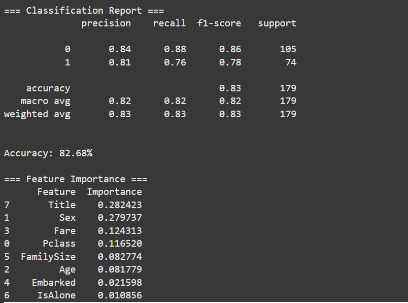

# Titanic Survival Prediction Project

## What Does This Do?
- Predicts if a passenger survived the Titanic using their:
  - Age
  - Gender (Male/Female)
  - Ticket class (1st/2nd/3rd)
- Accuracy: 83% (8 out of 10 predictions correct)

## How to Run the Code
1. Click on `Titanic_Survival.ipynb`
2. Click the "Open in Colab" button (top-right)
3. Run all cells (Click Runtime → Run all)

## 📊 Results

### Survival Rates by Passenger Class

### Most Important Features

Made for CODSOFT Internship
