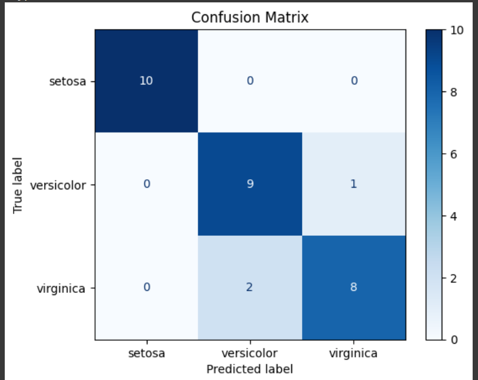
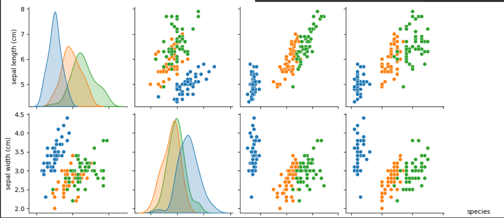
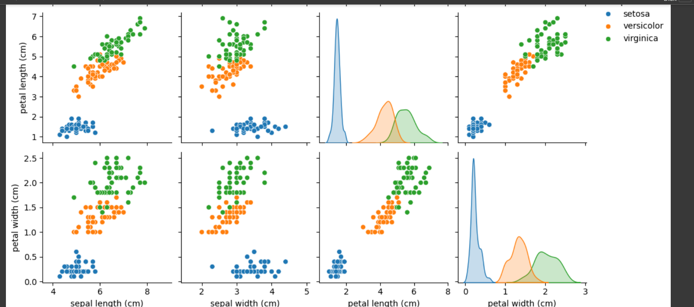

# Iris Flower Classification 🌸

| **Category**       | **Details**                                                                 |
|--------------------|----------------------------------------------------------------------------|
| **Objective**      | Classify Iris flowers into 3 species using measurements (sepal/petal)      |
| **Algorithms**     | Random Forest, SVM, KNN                                                    |
| **Best Accuracy**  | 90% (Random Forest)                                                        |

---

## 📊 Results

### 1. Model Performance
  
- **Accuracy**: 90%  
- **Confusion Matrix**: Shows occasional misclassification between *versicolor* and *virginica*.  
- **Precision/Recall**: >0.9 for all classes.

### 2. Feature Importance
  
- **Top Features**:  
  - Petal length (46%)  
  - Petal width (42%)  
  - Sepal measurements (12% combined).

---
# Iris Classification Results

## Output Visualizations

### 1. Confusion Matrix

### 2. Iris Classification Result 1

### 3. Iris Classification Result 2

