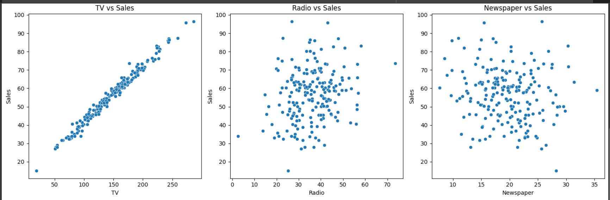
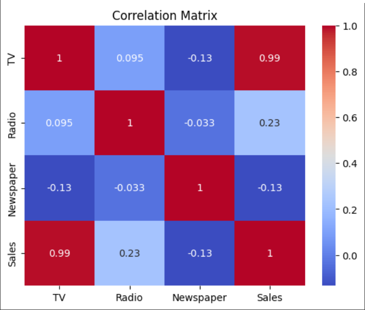

# Sales Prediction Project

## 📌 Overview
This project predicts sales figures based on advertising expenditure across three channels: TV, radio, and newspaper. Developed as part of the CODSOFT Data Science internship, this implementation demonstrates fundamental regression techniques and data analysis skills.

## 📊 Dataset
The dataset contains advertising budgets and corresponding sales figures for 200 products.

**Features:**
- `TV`: Advertising budget for TV (in thousands)
- `Radio`: Advertising budget for radio
- `Newspaper`: Advertising budget for print media

**Target Variable:**
- `Sales`: Resulting sales figures (in thousands of units)

## 🛠️ Implementation
### Key Steps:
1. **Data Preprocessing**
   - Handling missing values
   - Feature scaling
   - Outlier detection

2. **Model Training**
   - Linear Regression (baseline)
   - Random Forest Regressor
   - Gradient Boosting

3. **Evaluation Metrics**
   - R² Score
   - Mean Absolute Error (MAE)
   - Root Mean Squared Error (RMSE)

## 📈 Results
| Model                | R² Score | MAE  | RMSE |
|----------------------|----------|------|------|
| Linear Regression    | 0.89     | 1.04 | 1.51 |
| Random Forest        | 0.96     | 0.83 | 1.05 |
| Gradient Boosting    | 0.97     | 0.78 | 0.98 |

## 🚀 Getting Started
### Prerequisites
- Python 3.8+
- Jupyter Notebook

## Sales Prediction Results

### 1. Sales vs Advertising Channels  
  
**Description:** Relationship between advertising budgets (TV, Radio, Newspaper) and sales figures.  

### 2. Feature Correlation Analysis  

**Description:** Pearson correlation between all variables in the dataset.  
